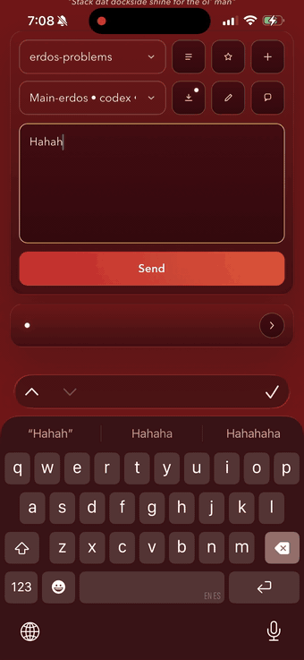

# clawdad

<p align="center">
  
</p>

Multi-agent orchestration CLI for AI coding agents. Manages persistent spoke agents across your projects from a single hub, using [ORP](https://orp.earth) as the canonical data store.

Codex-first orchestration for OpenAI-powered coding work, with Chimera still available as an experimental path.

Clawdad's product line is one front door for agent-operated work. Hermes Agent,
OpenClaw, and other always-on agent runtimes are useful systems to study, but
Clawdad should borrow their gateway, skills, notification, and backend ideas
without letting them become parallel sources of truth. See
[Borrowing From Agent Runtimes](docs/BORROWING_FROM_AGENT_RUNTIMES.md).

<p align="center">
  
</p>

## Install

Before you start:

- install [ORP](https://orp.earth) >= 0.4.27, `jq`, `sqlite3`, and the `codex` CLI
- install [Tailscale](https://tailscale.com/download) on your Mac and phone if you want the private mobile app

```bash
npm install -g clawdad
clawdad init
```

## Fastest Secure Setup

1. Sign into Tailscale on your Mac and your phone.
2. Register a repo with the provider you want to use.
3. Bootstrap the private listener.
4. Start the service once.
5. Open the private tailnet URL on your phone.

```bash
# Register a project bucket with its first tracked session
clawdad register ~/code/my-project --provider codex

# Write the secure listener config, shortcut template, and service file
clawdad secure-bootstrap --default-project my-project --apply-serve

# Start it once on macOS
launchctl bootstrap gui/$(id -u) ~/Library/LaunchAgents/com.sproutseeds.clawdad.server.plist
launchctl kickstart -k gui/$(id -u)/com.sproutseeds.clawdad.server

# Or start it once on Linux
systemctl --user daemon-reload
systemctl --user enable --now clawdad-server.service

# Verify the deployment
clawdad secure-doctor
```

Then open:

```text
https://YOUR-DEVICE.YOUR-TAILNET.ts.net/
```

`secure-bootstrap` usually infers your current Tailscale login automatically. Add the app to your iPhone home screen if you want it to feel native.

For a small single-host setup, the device URL is enough. For a team or hosted
setup that should keep a stable phone URL, use a durable Tailscale Service URL
such as:

```text
https://clawdad.YOUR-TAILNET.ts.net/
```

That durable route still stays private to your tailnet. Team members only need
Tailscale connected on their phone and the Clawdad URL; the host/admin owns the
service process and routing setup. See
[Tailscale Live Services](docs/tailscale-live-services.md) for the tagged
service-host pattern.

If you ever just want the local CLI and not the phone app yet, you can stop after `clawdad register`.

## What You Get

- project picker
- session picker
- add-project flow for existing repos or new repos under allowed roots
- per-session thread viewer with lazy-loaded history
- cross-project queue for in-flight and completed work
- saved project summary snapshots with manual refresh
- cached message audio via ElevenLabs, with manual download/play controls and optional auto-download
- Codex delegate mode with semantic hard stops and a weekly compute reserve guard

Tap the summary icon beside the project picker to open the latest saved snapshot or request a fresh one.

Message audio starts as a download icon. Tapping it prepares and caches the MP3;
after it is ready the control becomes a speaker icon for playback. The queue
header has an `Auto audio` toggle for preloading recent and future response
audio without autoplay. The API key stays on the Clawdad server: set
`ELEVENLABS_API_KEY` or
`CLAWDAD_ELEVENLABS_API_KEY`, or store a macOS Keychain generic password named
`clawdad-elevenlabs`. Generated MP3 parts are cached under the project at
`.clawdad/audio/messages/` for replay.

## CLI Quick Start

```bash
# Dispatch to the active session inside a tracked project bucket
clawdad dispatch my-project "What's the architecture of this project?"

# Inspect or switch tracked sessions for that directory
clawdad sessions my-project
clawdad use-session my-project "my-project (2)"

# Check status
clawdad status

# Read the response
clawdad read my-project
```

## Commands

| Command | Description |
|---------|-------------|
| `clawdad init` | Initialize ~/.clawdad and verify ORP |
| `clawdad register <path>` | Register a project (writes ORP tab) |
| `clawdad add-session <project>` | Add another tracked session to an existing project bucket |
| `clawdad rename-session <project> <session> <title>` | Rename one tracked session for easier organization |
| `clawdad remove-session <project> <session>` | Remove one tracked session while keeping the project bucket |
| `clawdad unregister <slug>` | Remove a project (removes ORP tab) |
| `clawdad dispatch <slug> "msg"` | Send a message to a spoke agent |
| `clawdad sessions <slug>` | List tracked sessions for a project bucket |
| `clawdad use-session <project> <session>` | Switch the active tracked session for a project bucket |
| `clawdad status [slug]` | Show status of projects |
| `clawdad list` | List registered projects (from ORP) |
| `clawdad read <slug>` | Read latest response from a spoke |
| `clawdad delegate <slug>` | Show the saved delegate brief, plan, status, and guardrails |
| `clawdad delegate-set <slug> ...` | Update the delegate brief or guardrails such as `--compute-reserve-percent 10`, `--direction-check-mode enforce`, or opt-in Watchtower with `--watchtower-review-mode log` |
| `clawdad go <slug>` | Friendly autonomous delegation entrypoint after ORP confirms a safe continuation |
| `clawdad delegate-run <slug>` | Start autonomous Codex delegate mode for a project |
| `clawdad supervise <slug> --lane <laneId>` | Opt into continuity orchestration that restarts bounded delegate runs only after ORP, compute, and direction gates pass |
| `clawdad delegate-pause <slug>` | Pause autonomous delegate mode after the current step |
| `clawdad sessions-doctor [slug]` | Audit stale/quarantined sessions and delegate lanes; add `--repair` for non-destructive cleanup |
| `clawdad codex install [slug|path]` | Install the project-local Codex hooks, skills, plugin, marketplace entry, and AGENTS guidance |
| `clawdad codex doctor [slug|path]` | Audit the Codex integration pack for drift |
| `clawdad watchtower <slug>` | Run the read-only delegation observer sidecar |
| `clawdad watch <slug>` | Friendly alias for `watchtower` when a project is supplied |
| `clawdad feed tail <slug>` | Show recent Watchtower feed events |
| `clawdad feed search <slug> "query"` | Search the local SQLite/FTS delegation feed |
| `clawdad feed review <slug>` | Show queued Watchtower review cards |
| `clawdad watch` | Monitor mailboxes for responses |
| `clawdad serve` | Run a secure HTTP listener for remote/iPhone entrypoints |
| `clawdad secure-bootstrap` | Write the recommended Tailscale-first self-hosted setup |
| `clawdad secure-doctor` | Verify the secure self-hosted deployment end-to-end |
| `clawdad chimera-doctor` | Verify the local Chimera/Ollama provider lane |
| `clawdad gen-token --write` | Generate and store a bearer token for the listener |
| `clawdad install-launch-agent` | Install a macOS launchd plist for always-on listening |
| `clawdad install-systemd-unit` | Install a Linux systemd user unit for always-on listening |

## How It Works

1. **Register** a project bucket — clawdad stores one ORP tab per tracked session, grouped by project path
2. **Select** an active session — each project bucket keeps one active tracked session at a time
3. **Dispatch** a message — clawdad reads the active session from ORP/state, builds the non-interactive CLI command for the right provider, and runs it in the background
4. **Respond** — the spoke agent processes the request and its output is captured to `.clawdad/mailbox/response.md`
5. **Read** — you (or the hub agent) read the response when ready

Each spoke agent accumulates context over time via session resume, so it develops deep knowledge of its project.

Delegate mode is Codex-first and runs on the same machine as the Clawdad server. By default it keeps working indefinitely until the project is semantically complete, paused, blocked by a hard stop, or Codex compute reaches the saved weekly reserve. The default compute reserve is 10%, and you can change it per project:

```bash
clawdad delegate-set my-project --compute-reserve-percent 10
clawdad go my-project
```

`clawdad go` and `clawdad delegate-run` both ask ORP whether autonomous work is
safe before the delegate loop starts. Clawdad runs `orp hygiene --json`, `orp
project refresh --json`, and `orp frontier preflight-delegate --json` from the
project directory. If ORP reports missing research-system/frontier state,
bootstrap the repo first:

```bash
orp init --research-system --project-startup --current-codex --json
```

If ORP reports unclassified dirty state, no active safe continuation, paid or
human-gated work, or another hard stop, Clawdad prints the ORP reason and leaves
the delegate loop stopped.

`clawdad supervise <slug> --lane <laneId>` is an explicit continuity loop, not
Watchtower and not a replacement for bounded delegate runs. It watches the target
lane status, consumes a completed run's `nextAction`, refreshes the lane
objective, reruns the ORP and compute gates, checks whether the proposed
continuation still matches the lane objective and latest readback, and starts
exactly one new bounded delegate run when safe. Use `--once` for a single
supervisor tick, `--daemon` for a background supervisor, `--interval <seconds>`
for polling, `--max-runs <n>` for a per-invocation cap, and `--dry-run` to
inspect the next decision without starting a worker.

The direction check is the first Hermes-inspired supervisor layer. It uses a
compact readback of objective, latest outcome, previous `nextAction`, proposed
`nextAction`, and gate state instead of hydrating another full project transcript.
The default mode is `observe`, which records aligned/caution/pause decisions
without blocking. Set `--direction-check-mode enforce` on a lane when a pause
decision should block restart, or `--direction-check-mode off` when the lane does
not need this readback.

The web app exposes the same control path as **Auto-Claw**. Open a project, click
Auto-Claw, preview the launch checks, then start or stop the supervisor loop from
the project lane. The modal keeps Clawdad as the control plane: launch checks show
the ORP and compute gates before work starts, runtime checks update from worker
status and supervisor events, and the Loop tab shows continuity transitions such
as restart, wait, stop, blocker, and completion.

Watchtower is an optional read-only delegation review sidecar. It watches
delegate run events, ORP continuation/hygiene state, and git status, then appends
structured updates and review cards to `.clawdad/feed/watchtower.sqlite`. It does
not edit, approve, or advance the project unless a delegate lane explicitly opts
into `--watchtower-review-mode enforce`.

In enforce mode, Watchtower hard stops still block the lane, including
credentials, paid/live-order boundaries, patient data, medical advice, outreach,
legal/regulatory gates, explicit human approval, and compute exhaustion. Softer
findings such as failing validation, ORP/catalog drift, hygiene repair, and large
diff checkpoints are converted into the supervisor's next delegate prompt so the
same delegate session repairs or checkpoints the work instead of pausing.

`clawdad codex install <project>` makes the Codex side of a project explicit and
repairable. It writes project-local Codex lifecycle hooks, a small hook runner,
repo-scoped Clawdad skills, a local `clawdad-codex-integration` plugin package,
a repo marketplace entry, and a managed Clawdad block in `AGENTS.md`.

The generated hooks are intentionally narrow: they add compact Clawdad context
on session start, annotate release/publish/privilege actions for review, log
compact tool signals to `.clawdad/codex-hooks/events.jsonl`, and deny only
hard-risk commands such as destructive resets or credential exposure. The
generated skills cover delegate, supervisor, Watchtower review, session doctor,
release, and incident triage workflows so Codex can load those instructions only
when the task calls for them.

Run `clawdad codex doctor <project> --json` to verify hooks, skills, plugin
packaging, marketplace state, `AGENTS.md`, and whether project-local Codex
configuration may still need trust in the user Codex config. On Codex 0.128.0
or newer, delegate lanes also sync a concise app-server thread goal by default;
set `CLAWDAD_CODEX_GOALS=off` to fall back to prompt-only behavior or
`CLAWDAD_CODEX_GOALS=required` to fail dispatch when goal sync is unavailable.
The web app exposes the same check/install flow from the project Codex action.

```bash
clawdad watchtower my-project --once
clawdad feed tail my-project
clawdad feed search my-project "paper fills"
clawdad feed review my-project
```

Review cards are queued for important changes such as active ORP item changes,
checkpoint commits, failing tests, dirty unclassified hygiene, sensitive
broker/payment/credential/live-order file boundaries, readiness claims, paper
results, paid/API entitlement mentions, large diffs, and blocked or paused runs.
The first store is local SQLite with FTS search; embeddings can be layered on
later without changing the observer contract.

If a project uses ORP Frontier additional items, Clawdad checks that queue whenever a delegate marks a run complete. A queued item is activated and becomes the next delegate action instead of ending the run:

```bash
orp frontier additional add-list --id additional-1 --label "Follow-up work"
orp frontier additional add-item --list additional-1 --id item-1 --label "Polish reports"
clawdad delegate-run my-project
```

## Architecture

```
ORP workspace (source of truth)
  └── tabs[] — one tracked session per tab:
      path, title, resumeTool, resumeSessionId

~/.clawdad/
  └── state.json — project-bucket status + active session + per-session stats

<project>/.clawdad/
  └── mailbox/
      ├── request.md      # Latest request from hub
      ├── response.md     # Latest response from spoke
      └── status.json     # idle | running | completed | failed
```

## Providers

clawdad dispatches to the right CLI based on the active session's `resumeTool`:

| Provider | Interactive (human) | Non-interactive (clawdad) |
|----------|-------------------|--------------------------|
| Codex | `codex` or `codex resume <id>` | Native saved Codex thread created or adopted per repo, then Clawdad resumes that same thread programmatically |
| Chimera | `chimera --resume <id>` | `chimera --model local --prompt "msg" --resume <id> --json` after Clawdad seeds and maintains the session file |

Chimera is Clawdad's local-first provider lane. Install `chimera-sigil` or keep a
sibling `../Chimera` checkout, pull an Ollama model, then register or add a
project session with `--provider chimera`. Run `clawdad chimera-doctor` when the
local lane needs a quick health check. See [Chimera Local Lane](docs/chimera-local-lane.md).

## Requirements

- zsh
- node >= 18
- jq
- sqlite3 with FTS5
- orp CLI >= 0.4.27 (workspace tab management and delegate preflight)
- codex CLI
- chimera CLI from `chimera-sigil` (optional local-first provider)
- tmux (for watch daemon mode)

## Secure Setup Notes

- `clawdad serve` stays on `127.0.0.1`.
- `tailscale serve` gives you a private HTTPS URL on your tailnet.
- the recommended path does not need a bearer token
- `secure-bootstrap` writes `~/.clawdad/server.json`, the iPhone Shortcut template, and the OS service file for you
- if you want multiple Tailscale users, add `--allow-user <login>` more than once
- if you skip `--apply-serve`, `secure-bootstrap` prints the exact `tailscale serve` command to run
- durable team URLs can use a tagged Tailscale Service host, for example `svc:clawdad` behind `https://clawdad.YOUR-TAILNET.ts.net`
- do not enable public Funnel unless you explicitly want a public internet surface
- `secure-doctor` also checks node key expiry, local Tailscale CLI/daemon drift, public Funnel exposure, tagged Service readiness, and any sibling app health URLs configured under `tailscale.liveApps`

The mobile app and automation routes live under the same origin:

- `GET /`
- `GET /v1/whoami`
- `GET /v1/projects`
- `GET /v1/project-roots`
- `GET /v1/project-summary`
- `GET /v1/delegate/feed`
- `GET /v1/delegate/run-log`
- `GET /v1/history`
- `POST /v1/projects`
- `POST /v1/active-session`
- `POST /v1/project-summary`
- `POST /v1/dispatch`
- `GET /v1/status`
- `GET /v1/read`

If you want a local-only or transitional listener instead, token auth still works:

```bash
clawdad gen-token --write
clawdad serve --auth-mode token --host 127.0.0.1 --port 4477
```

If you use token auth remotely, keep the listener on `127.0.0.1` and place it behind an encrypted private tunnel.

## Codex Session Notes

Clawdad now treats each directory as a project bucket with one active tracked session:

- Codex can expose multiple tracked sessions inside the same directory.
- Chimera follows the same bucket/session model as it matures.

The main mobile flow stays simple: pick the project bucket, write the message, send. Session switching is a secondary control.

If a Codex transport or delegate worker dies mid-dispatch, Clawdad quarantines the bad session instead of reusing it. `clawdad sessions-doctor --json` audits every tracked project for stale active pointers, quarantined session bindings, and orphaned delegate lanes; `clawdad sessions-doctor --repair` clears those pointers and marks orphaned delegate runs failed without deleting project files or unknown state.

For mobile project setup, Clawdad now supports two safe paths under allowed top-level roots:

- choose an existing repo that already lives under an allowed root
- create a new repo directory under an allowed root, then attach a fresh tracked session

If the chosen repo is already tracked, Clawdad adds a new session to that project bucket instead of creating a duplicate project entry.

For Codex-backed projects, Clawdad now prefers native repo-attached Codex threads:

- if a repo already has a native saved Codex thread, Clawdad adopts that thread id when you register or add a session
- if a repo has no saved Codex thread yet, the first `clawdad dispatch` creates a real native Codex thread for that repo and writes that thread id back into ORP
- after that, later Clawdad dispatches resume the same saved Codex thread automatically

That means later terminal use lines up much better with normal Codex behavior: when you return to that repo and use Codex there, you are looking at the same saved thread world instead of a separate Clawdad-only exec session type.

Permission modes map to Codex sandbox behavior like this:

- `plan` -> read-only sandbox with no network access
- `approve` -> workspace-write sandbox with network access enabled for unattended remote work
- `full` -> danger-full-access

## Chimera Session Notes

For Chimera-backed projects, Clawdad seeds a real Chimera session on first use,
then dispatches future requests through `chimera --model local --prompt --resume
<id> --json`. `CLAWDAD_CHIMERA_MODEL` defaults to `local`, and one-off dispatches
can still pass `--model local-coder` or any other Chimera/Ollama profile.

Large workstation profiles route to a separate Ollama endpoint when configured.
Set `CLAWDAD_CHIMERA_4090_OLLAMA_BASE_URL` to the OpenAI-compatible Ollama URL on
the 4090 host, preferably through its Tailscale MagicDNS name, then dispatch
with `--model local-coder-4090` or `--model local-4090`. Regular profiles such
as `local` keep using the Mac/local Ollama endpoint.

Permission modes pass through to Chimera: `plan` stays conservative, `approve`
allows workspace writes while denying shell execution, and `full` allows all
Chimera tools.

## Support

Everything here is released for public use. If Clawdad saved you time or you want to keep the work moving, you can [support public FRG releases](https://frg.earth/support?utm_source=readme&utm_medium=repo&utm_campaign=public_work_support&package=clawdad).
